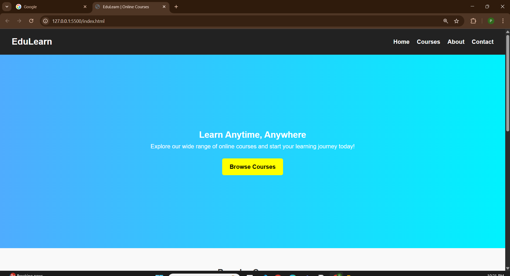
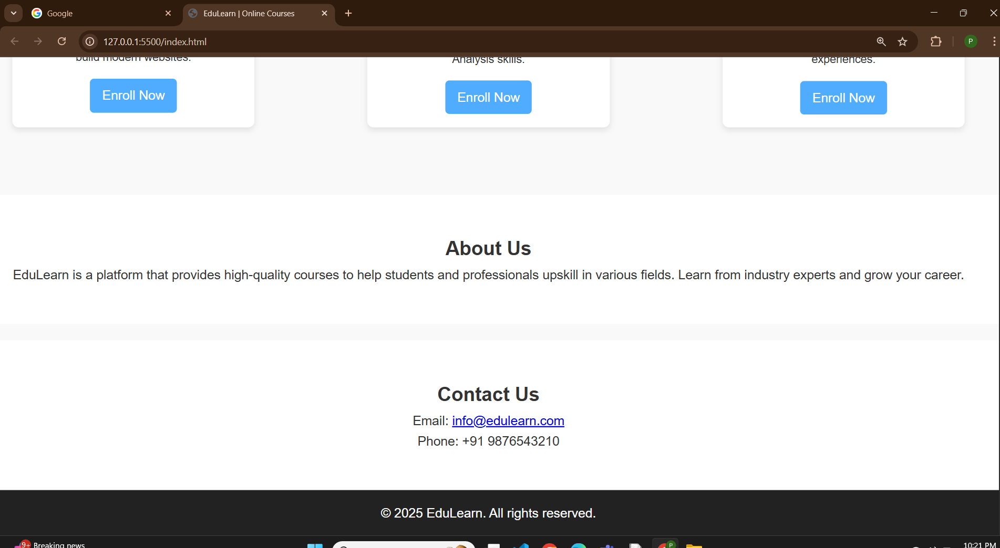

# 🎓 EduLearn - Education Course Website

A responsive **Education Course Website** built using **HTML + CSS**.  
This project is designed as a template for an online learning platform with sections for **Home, Courses, About, and Contact**.

---                   

## 🚀 Features
- Responsive layout for all devices     
- Hero section with a call-to-action  
- Popular Courses section with cards   
- About Us & Contact sections  
- Clean and modern CSS design  

---

## 📸 Screenshots
### 🏠 Home Page

### 📚 Courses Section

### ℹ️ About & Contact

---

## 🛠️ Tech Stack
- HTML5  
- CSS3  

---
